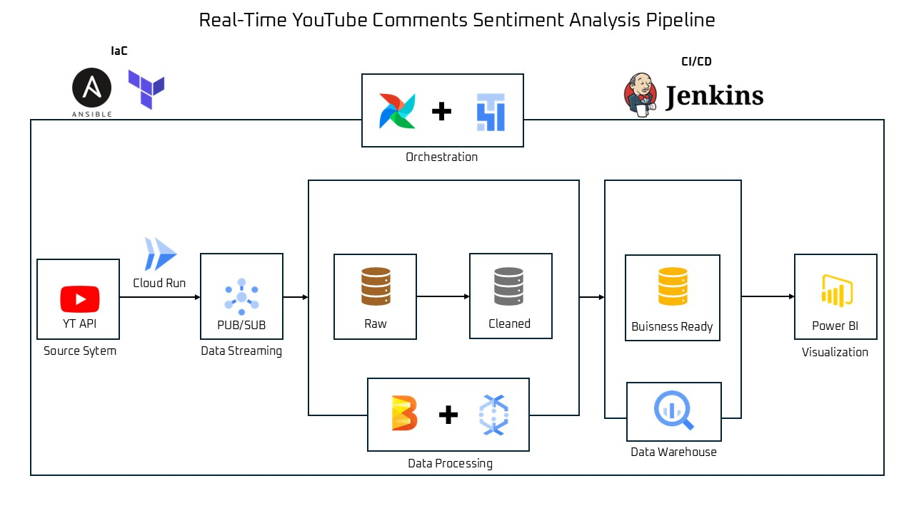

# Real-Time YouTube Comments Sentiment Analysis (GCP Data Engineering Pipeline)

## Project Overview

The goal of this project is to simulate a **production-style streaming data platform** capable of processing large volumes of real-time text data.

The pipeline collects **live YouTube comments**, analyzes their **sentiment (Positive, Neutral, Negative)**, and stores structured results in **BigQuery** for analytics and dashboarding via PowerBI.

This project demonstrates skills across **data engineering + DevOps + AI**.

---

## Architecture

<p align="center">
  
</p>

Pipeline workflow:

1. **YouTube API + Python** → A Python ingestion service retrieves YouTube comments and publishes them to Pub/Sub.

2. **Google Pub/Sub** → Serves as the real-time streaming ingestion layer.

3. **Apache Beam / Dataflow** → Processes incoming comments, applies sentiment analysis, and formats structured records.

4. **BigQuery** → Stores processed results and serves as the analytics warehouse.

5. **Cloud Composer (Airflow)** → Orchestrates pipelines, health checks, and workflow automation.

6. **Power BI** → Connects to BigQuery to provide dashboards and analytics.

7. **Terraform + Ansible + Jenkins** →  Automates infrastructure provisioning, environment configuration, and CI/CD deployment.

---

## Tech Stack

**Cloud & Infrastructure**
- Google Cloud Platform
- Terraform (Infrastructure as Code)
- Ansible (Configuration management)

**Data Engineering**
- Pub/Sub (Streaming ingestion)
- Apache Beam / Dataflow (Stream processing)
- BigQuery (Data warehouse)

**Orchestration & Automation**
- Jenkins (CI/CD pipelines)
- Cloud Composer / Apache Airflow

**Programming**
- Python (ETL logic, API integration, NLP sentiment scoring)

**Visualization**
- Power BI


---


## Repository Structure

```bash
yt-comments-gcp
├── ansible
│   ├── group_vars
│   │   └── all.yml
│   └── playbooks
│       ├── deploy_cf.yml
│       ├── deploy_dag.yml
│       ├── deploy_dataflow.yml
│       └── run_pretrained_sentiment.yml
├── app
│   ├── config.yaml
│   ├── main.py
│   └── requirements.txt
├── dags
│   └── yt_pipeline_dag.py
├── dataflow
│   ├── config.yaml
│   ├── pipeline.py
│   ├── requirements.txt
│   └── setup.py
├── infra
│   ├── backend.tf
│   ├── envs
│   │   └── dev
│   │       ├── main.tf
│   │       ├── outputs.tf
│   │       ├── tfplan
│   │       └── variables.tf
│   ├── modules
│   │   ├── bigquery
│   │   │   └── main.tf
│   │   ├── composer
│   │   │   └── main.tf
│   │   ├── iam
│   │   │   └── main.tf
│   │   ├── pubsub
│   │   │   └── main.tf
│   │   └── storage
│   │       └── main.tf
│   └── providers.tf
├── Jenkinsfile
├── ml
│   └── pretrained_sentiment.py
└── README.md
```


---


## 📫 Connect with Me

- **Author:** *Omar EL KALKHA*
- **LinkedIn:** [https://www.linkedin.com/in/omar-el-kalkha/](https://www.linkedin.com/in/omar-el-kalkha/)
- **Email:** [omarelkalkha5@gmail.com](mailto:omarelkalkha5@gmail.com)
